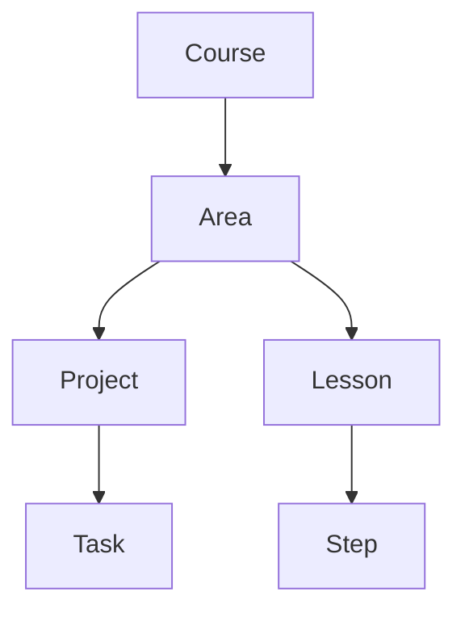

## Libraries used

All binary files, the `images` directory, and the `libv86.js` are taken from [copy's v86](https://github.com/copy/v86)
which is under the [Simplified BSD License](https://github.com/copy/v86/blob/master/LICENSE).

Some files are modified

`codemirror.css`, `codemirror.js` and `clike.js` are taken from [CodeMirror 5](https://codemirror.net/5/)
licensed under [MIT](https://github.com/codemirror/codemirror5/blob/master/LICENSE).

`themes` are downloaded from [catppuccin for codemirror](https://github.com/catppuccin/codemirror)
licensed under [MIT](https://github.com/catppuccin/codemirror/blob/main/LICENSE).

## Course structure

Areas:

- Linux (writing)
- C / C++
- Embedded development
- Bash scripting
- Networking
- Web

## VM interface

There is a global `vm` object which has:

- `send(command: string): void` and runs it immediately
- `screen: string` shows the output since the start of the VM
- `bindReceiver(fn: (char: string) => void): void` will call the receiver when a character is printed
